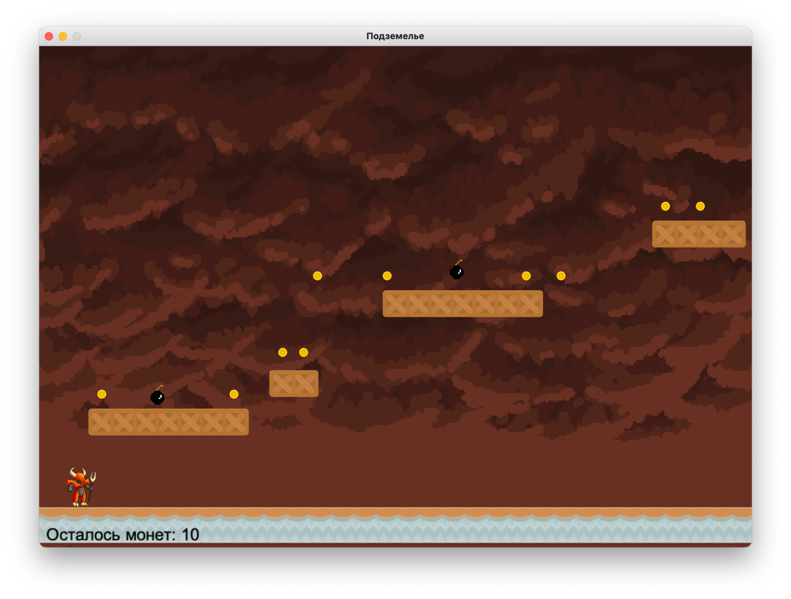

## Платформер "Подземелье"

Для запуска игры необходимо установить менеджер пакетов [Poetry](https://python-poetry.org/docs/#installation)

Затем в корне проекта выполнить команду:

Установить зависимости:
```bash
poetry install
```

Запустить игру:
```bash
poetry run python game.py
```

